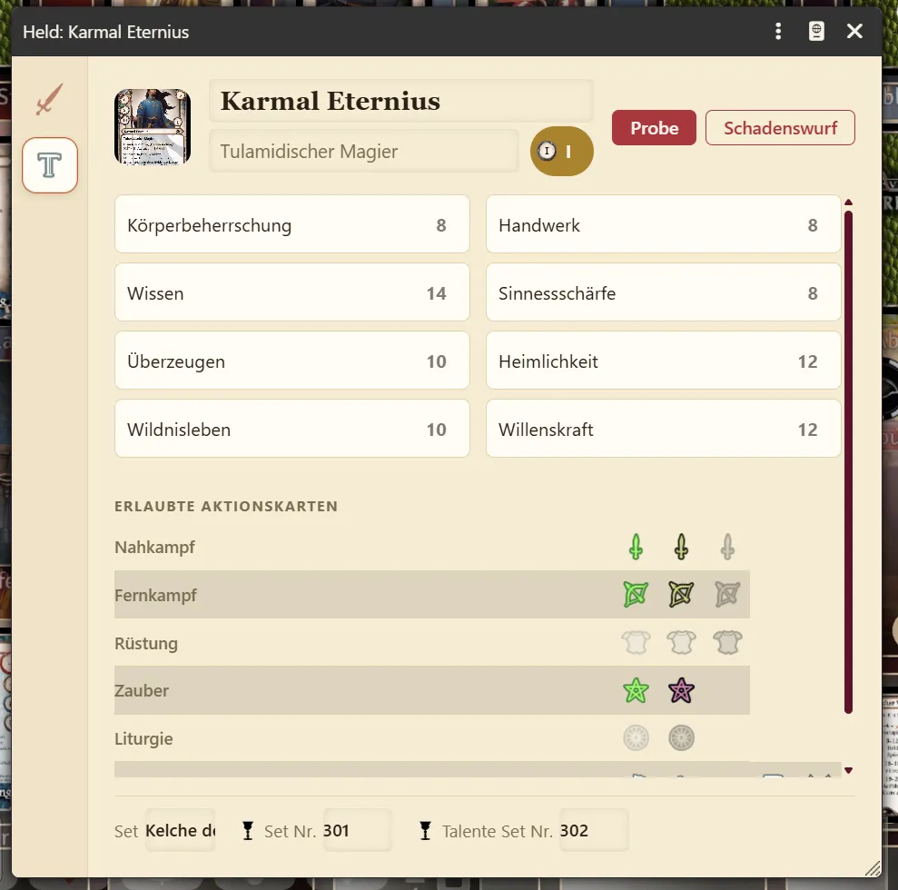
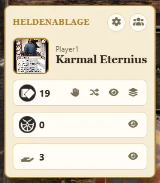
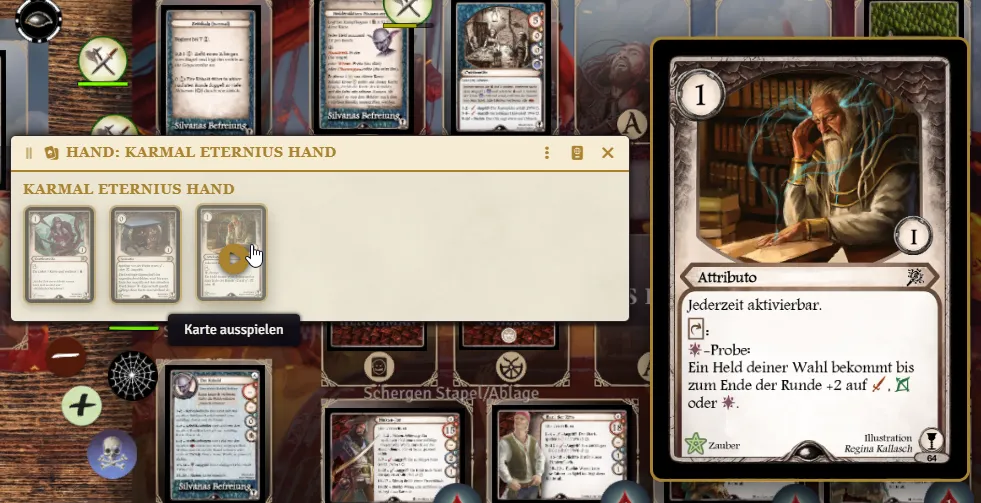
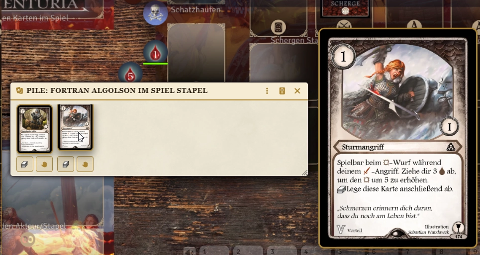
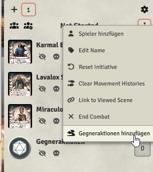
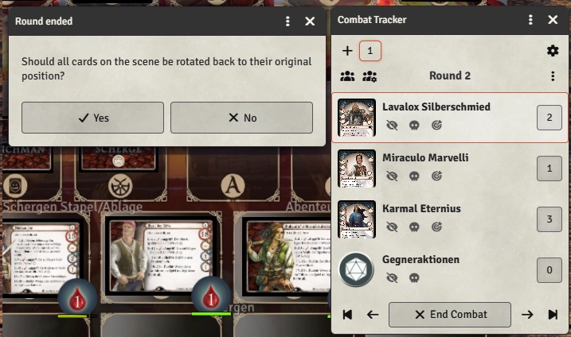
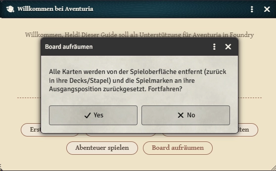
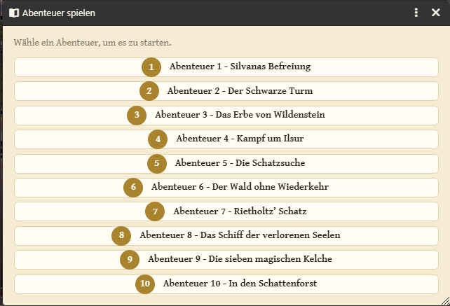
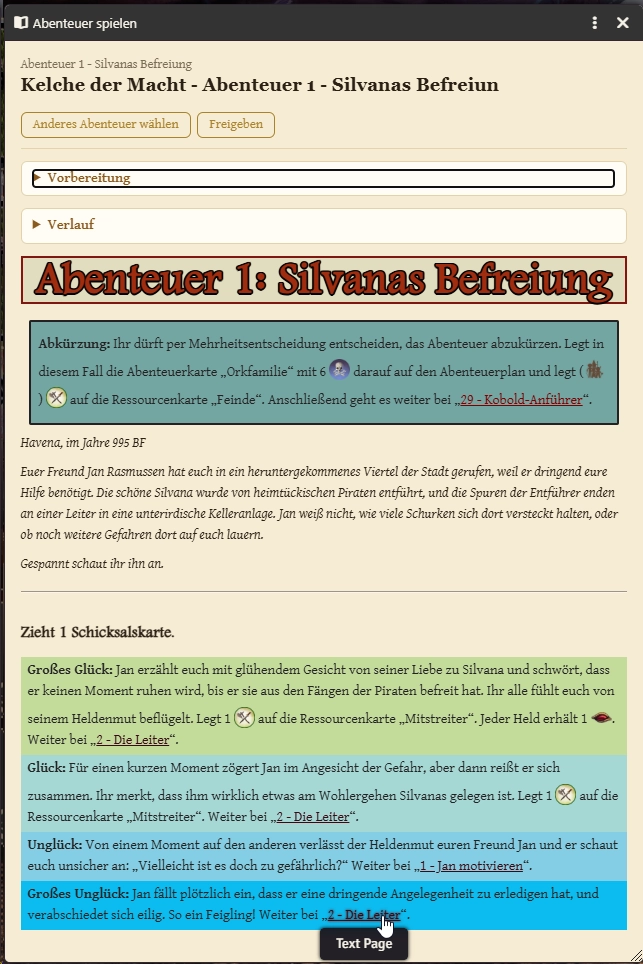
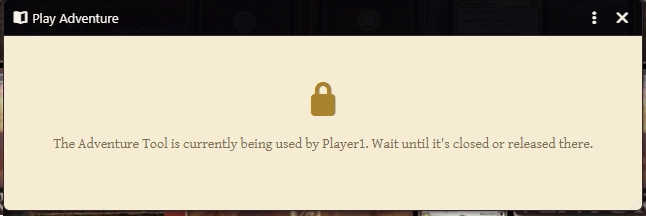

# Handbuch: aventuria-helpers (Test-Version)

Dieses Handbuch beschreibt die Kernfunktionen des Moduls `aventuria-helpers`: den neuen Charakterbogen, die Heldenablage mit Hand- und Ausgespielte-Karten-Fenster, die Erweiterungen am Kampf-Tracker, den Einrichtungs-Guide und das Abenteuer-Tool. Stand: erste Testversion, Rückmeldungen fließen in die nächste Überarbeitung ein.

## 1. Neuer Charakterbogen

Für Helden-Akteure gibt es ein alternatives, eigens gestaltetes Sheet als Ersatz für das generische Standard-Sheet des Systems. Es öffnet sich automatisch, sobald man den Heldenbogen aufruft (z.B. per Klick auf das Portrait in der Heldenablage, siehe Teil 2) oder lässt sich für einen Akteur per Rechtsklick → "Sheet konfigurieren" auswählen, falls noch das Standard-Sheet aktiv ist.

Links am Rand liegt eine schmale Icon-Leiste mit den Tabs:

- **Held** (siehe Screenshot oben): Eigenschaften (Nahkampf, Fernkampf, Magie, Ausweichen), Lebenspunkte, Grundausrüstung und ggf. zweite Ausrüstung (teilen sich einen gemeinsamen Erschöpfen-Status - Aventuria-Regel: Waffennutzung erschöpft die ganze Heldenkarte), die acht Talente, Sonderfertigkeit.
- **Erlaubte Aktionskarten:** Tabelle, welche Kategorien von Aktionskarten dieser Held laut seiner Heldenkarte spielen darf.
- **Bilder:** Heldenkarte und Talentkarte nebeneinander, per Klick austauschbar bzw. in Großansicht zu öffnen.
- **Items** und **Effekte:** wie vom Standard-Sheet gewohnt.

**Proben würfeln:** Nicht nur der allgemeine "Probe würfeln"-Button oben im Kopf funktioniert – jede Eigenschaft (Klick auf das runde Icon-Medaillon) und jedes Talent (Klick auf den Namen) lässt sich einzeln anklicken und würfelt direkt eine eigene Probe dafür. Bei der Ausrüstung löst das kleine Icon im Angriffsart-Feld Angriffsprobe und Schadenswurf in einem Schritt aus und markiert die Ausrüstung danach automatisch als erschöpft.

**Spielmodus-Schalter:** Unten in der Icon-Leiste lässt sich das Sheet per Schalter sperren, um versehentliche Änderungen während des Spiels zu vermeiden. Lebenspunkte, Proben würfeln und Erschöpfen-Status bleiben auch gesperrt weiter bedienbar, nur die eigentlichen Charakterwerte sind dann schreibgeschützt.

## 2. Heldenablage mit Hand- und Ausgespielte-Karten-Fenster

### 2.1 Grundlagen

Die Heldenablage sitzt unten links im Bildschirm, genau dort, wo sonst die normale Foundry-Spielerübersicht (Liste der angemeldeten Spieler) steht. Beide teilen sich denselben Platz – es ist immer nur eine von beiden sichtbar.

**Umschalten zwischen Ablage und Spielerübersicht:**

- Ist gerade die Spielerübersicht sichtbar: rechts daneben schwebt eine kleine runde Schaltfläche mit einem Heldentoken-Symbol. Klick darauf öffnet die Heldenablage.
- Ist die Ablage sichtbar: oben rechts in der Ablage selbst gibt es eine runde Schaltfläche mit einem Personen-Symbol. Klick darauf wechselt zurück zur Spielerübersicht.
- Die zuletzt gewählte Ansicht wird gemerkt (übersteht auch ein Neuladen der Seite).

**Erster Start – Held auswählen:** Ist der Ablage noch kein Held zugewiesen, zeigt sie nur ein rundes, gestricheltes Feld mit einem "Person hinzufügen"-Symbol. Ein Klick darauf startet Aventurias eigenen Ablauf "Bereite Spieler vor" (Heldenauswahl aus dem Kompendium + Spielernummer, wie beim Einrichten eines neuen Charakters gewohnt). Sobald das abgeschlossen ist, füllt sich die Ablage automatisch mit dem neuen Helden.

### 2.2 Deck, Ablage, Hand und Ausgespielte Karten im Überblick

Sobald ein Held zugewiesen ist, zeigt die Ablage oben das Heldenportrait (Spielername darüber, Heldenname darunter; Klick darauf öffnet den Heldenbogen aus Teil 1) mit einem Papierkorb-Symbol daneben - **Held löschen**: löscht nach einer Sicherheitsabfrage den Helden samt Deck, Ablage, Hand und Im-Spiel-Stapel unwiderruflich. Darunter folgen mehrere Kacheln:

**Deck** (Kartenrückseiten-Symbol, Zahl = verbleibende Karten im Deck):

- Hand-Symbol – **Karte ziehen**: zieht eine Karte vom Deck in die Hand.
- Misch-Symbol – **Deck mischen**.
- Augen-Symbol – **Kartenvorschau**: fragt nach einer Anzahl und zeigt die obersten X Karten des Decks an, ohne sie zu ziehen.
- Stapel-Symbol – **Deck ansehen**: öffnet die vollständige Deck-Ansicht (Complete Card Management).

**Ablage** (Ablage-Symbol, Zahl = Karten im Ablagestapel):

- Augen-Symbol – **Ablage ansehen**: öffnet den Ablagestapel.

**Hand** (Hand-Symbol, Zahl = Karten in der Hand):

- Augen-Symbol – **Hand ansehen**: öffnet das eigene Hand-Fenster (siehe Abschnitt 2.3).

**Ausgespielte Karten** (Kartenstapel-Symbol, Zahl = Anzahl aktuell ausgespielter Karten, ohne Ausdauerkarten):

- Augen-Symbol – **Ausgespielte Karten ansehen**: öffnet das Ausgespielte-Karten-Fenster (siehe Abschnitt 2.4).

**Ausdauer** (eine gemeinsame Zeile, verfügbar links und erschöpft rechts, Zahl = Karten im jeweiligen Zustand):

- Dreh-Symbol links (bei "Verfügbar") – **Ausdauer erschöpfen**: dreht eine bereite Ausdauerkarte manuell um 90°.
- Dreh-Symbol rechts (bei "Erschöpft") – **Ausdauer bereit machen**: dreht eine erschöpfte Ausdauerkarte zurück.

Alle Zahlen aktualisieren sich automatisch, sobald sich etwas an den eigenen Karten ändert (Ziehen, Mischen, Spielen usw.).

**Held/Hand konfigurieren:** Das Zahnrad-Symbol oben in der Ablage (neben dem Umschalt-Button) öffnet Foundrys Nutzer-Einstellungen mit zwei relevanten Feldern: welcher Held zugewiesen ist ("Character") und welche Hand als eigene Hand gilt ("Player Hand"). Nützlich, um ohne erneuten "Bereite Spieler vor"-Durchlauf auf einen bereits vorhandenen Helden oder eine bereits vorhandene Hand umzustellen.

### 2.3 Der Hand-Bogen

Über "Hand ansehen" öffnet sich ein eigenes Fenster mit allen Karten der aktuellen Hand, nebeneinander als Reihe.

- **Andocken, Verschieben, Zurücksetzen:** Das Fenster dockt beim Öffnen automatisch rechts neben der Heldenablage an und bleibt dort auch, wenn die Ablage ein- oder ausgeblendet wird. Es lässt sich trotzdem jederzeit frei verschieben - einfach an der Kopfleiste ziehen. Sobald das geschieht, hört das Fenster auf, der Ablage automatisch zu folgen. Über das "..."-Menü in der Kopfleiste (drei Punkte) lässt sich "Position zurücksetzen" wählen, um es wieder an seinen angedockten Platz zu holen.
- **Größe:** Das Fenster ist standardmäßig 600 Pixel breit und wächst automatisch mit der Anzahl der Handkarten horizontal in einer einzelnen Reihe (kein Zeilenumbruch) - passen mehr Karten nicht mehr hinein, erscheint ein horizontaler Scrollbalken statt eines weiter wachsenden Fensters. Am rechten unteren Eckgriff lässt sich das Fenster bei Bedarf noch breiter oder höher ziehen.
- **Vorschau:** Fährt man mit der Maus über eine Karte, öffnet sich daneben eine große, gut lesbare Vorschau der Karte (siehe Screenshot oben).
- **Ausspielen:** Auf einer Karte erscheint beim Darüberfahren ein Play-Symbol in der Mitte – Klick darauf spielt die Karte aus. Kostet die Karte Ausdauer, fragt vorher ein kleiner Dialog, ob die Ausdauer normal bezahlt oder die Karte stattdessen kostenlos ("ohne Ausdauer") gespielt werden soll.
- **Als Ausdauer spielen:** Ein zweites Symbol legt die Karte stattdessen verdeckt als Ausdauer aus, ohne sie regulär auszuspielen.
- **Ziehen/Ablegen:** Karten lassen sich weiterhin wie gewohnt per Drag & Drop verschieben (z.B. auf die Spieloberfläche).
- **Rechtsklick** auf eine Karte öffnet ein Menü zum Umdrehen bzw. zur nächsten/vorherigen Kartenseite (sofern die Karte mehrere Seiten hat).
- Ein erneuter Klick auf "Hand ansehen" öffnet kein zweites Fenster, sondern holt ein bereits offenes nur wieder nach vorne. Über das "X" in der Kopfleiste lässt sich das Fenster ganz normal schließen.

### 2.4 Ausgespielte Karten

Über "Ausgespielte Karten ansehen" (Heldenablage, siehe 2.2) öffnet sich ein weiteres Fenster mit allen aktuell ausgespielten Karten - alles, was regulär aus der Hand heraus gespielt wurde, aber noch nicht abgelegt oder zurückgenommen ist. Als Ausdauer ausgespielte Karten erscheinen hier bewusst **nicht** - die zählen weiterhin nur in der Ausdauer-Zeile der Heldenablage (siehe 2.2).

- **Andocken, Verschieben, Größe, Zurücksetzen:** Funktioniert genauso wie beim Hand-Fenster (siehe 2.3) - dockt standardmäßig direkt unterhalb des Hand-Fensters an (an dessen Stelle, falls dieses gerade nicht geöffnet ist), lässt sich frei verschieben, wächst standardmäßig auf 600 Pixel Breite mit Eckgriff zum Vergrößern, und "Position zurücksetzen" im "..."-Menü holt es zurück an seinen Platz.
- **Vorschau:** Wie beim Hand-Fenster zeigt das Darüberfahren mit der Maus eine große Vorschau der Karte.
- **Ablegen:** Legt die Karte in die Ablage.
- **Zurück auf die Hand nehmen:** Nimmt die Karte zurück auf die eigene Hand - der übliche Weg, einen Kartenzug rückgängig zu machen.
- **Rechtsklick** auf eine Karte öffnet ein Menü mit dem selteneren Fall "Zurück ins Deck mischen" - mischt die Karte direkt wieder ins Deck.
- Genau wie beim Hand-Fenster öffnet ein erneuter Klick auf "Ausgespielte Karten ansehen" kein zweites Fenster, sondern holt das bereits offene nach vorne. Über das "X" in der Kopfleiste lässt sich das Fenster ganz normal schließen.

## 3. Kampf-Tracker

### 3.1 Rotierende Reihenfolge statt Würfeln

Aventuria würfelt normalerweise keine Initiative – das übernimmt der Kampf-Tracker jetzt automatisch:

- Wird ein Kämpfer zum Tracker hinzugefügt, bekommt er automatisch eine Initiative-Zahl passend zur Hinzufüge-Reihenfolge. Manuelles Würfeln ist nicht mehr nötig.
- Sobald "Kampf beginnen" gedrückt wird, friert der Tracker die aktuelle Reihenfolge ein. Ab dann dreht sie sich jede Runde um genau einen Platz weiter: wer in Runde 1 zuerst dran war, ist in Runde 2 als Letztes dran, usw.

### 3.2 Feste Phasen-Einträge hinzufügen

Nur für die Spielleitung: Über das Zahnrad-/Drei-Punkte-Menü oben im Kampf-Tracker gibt es zwei neue Einträge, "Gegneraktionen hinzufügen" und "Rundenende hinzufügen".

Beide fügen einen Platzhalter-Eintrag ohne eigenes Token hinzu, der immer an letzter Stelle der Reihenfolge steht und sich – anders als die Helden – nicht mit durch die Runden dreht: "Gegneraktionen" (Initiative 0) markiert die Phase, in der die Spielleitung die Aktionen der Gegner abhandelt, "Rundenende" (Initiative -1, steht damit noch dahinter) die Phase für Effekte, die am Rundenende ablaufen (z.B. auslaufende Zustände).

### 3.3 Karten nach der Runde automatisch zurückdrehen

Sobald eine neue Kampfrunde beginnt, fragt die Spielleitung automatisch, ob alle auf der Spieloberfläche liegenden Karten wieder in ihre Ausgangs-Rotation (0°) zurückgedreht werden sollen – nur die Drehung, nicht die Position.

Bestätigen dreht alle gedrehten Karten zurück, "Nein" lässt alles wie es ist. Diese Abfrage erscheint nur bei der Spielleitung und nur, wenn Complete Card Management aktiv ist.

## 4. Einrichtungs-Guide

Ein eigenes Fenster führt Schritt für Schritt durch die Ersteinrichtung eines Aventuria-Tisches. Öffnen lässt es sich über das Fragezeichen-Symbol oben in der Heldenablage (Teil 2) oder über das Macro "Aventuria-Guide öffnen".

Die Startseite bietet neben dem Titel-Button zu diesem Handbuch und einem "Was ist neu?"-Button (öffnet die Versionshistorie, siehe 4.5) fünf Einstiege: "Erste Schritte", "Helden auswählen", "Schnellstarter vorbereiten", "Abenteuer spielen" (öffnet direkt das Abenteuer-Tool, siehe Teil 5) und "Board aufräumen" (siehe 4.6).

### 4.1 Erste Schritte

Einmalige Grundeinrichtung der Welt durch die Spielleitung, sieben Schritte: Benutzer mit der Rolle Spielleiter für jeden Mitspieler anlegen, Sprache einstellen, Spielbrett-Szene importieren, Aventuria-Macros importieren, Spielbrett vorbereiten (Ablagen/Decks anlegen), Decks und Stapel auf der Szene platzieren, Spielmarken (Lebenspunkte, Fertigkeit usw.) importieren und platzieren. Jeder Schritt erklärt kurz, was er tut, und hat einen eigenen Ausführen-Button.

### 4.2 Helden auswählen

Für jeden teilnehmenden Spieler zu wiederholen, zwei Schritte: Zuerst Spieler, Tischplatz und Held in einer Maske auswählen - Heldenbogen und Kartendeck werden dabei automatisch angelegt (ein vorhandener Held des Spielers wird ersetzt). Danach werden Deck, Ablage, Hand und Token dieses Helden mit einem Klick automatisch an ihren Platz auf dem Spielbrett gesetzt und das Deck gemischt.

### 4.3 Schnellstarter vorbereiten

Einmalig, nachdem alle teilnehmenden Spieler ihren Helden zugewiesen haben, vier Schritte: Helden vorbereiten (zieht für jeden der sechs Schnellstarter-Helden die Starthand und spielt vier Karten als Ausdauer aus), Abenteuer importieren (Ereigniskarten-Deck sowie die drei für den Einstieg benötigten Karten), Schergen vorbereiten (Schergen-Deck anlegen, platzieren, mischen) und zum Schluss das Abenteuer-Journal öffnen.

### 4.4 Zwischen Seiten navigieren

Jede Sektion zeigt eine Seite pro Schritt mit "Zurück"/"Weiter" sowie einer Seitenauswahl unten. Löst ein Schritt seine Aktion erfolgreich aus, blättert der Guide automatisch zur nächsten Seite weiter - ein zusätzlicher Klick auf "Weiter" ist dann nicht mehr nötig. Auf der letzten Seite einer Sektion heißt der Button "Beenden" und führt zurück zur Startseite, von der aus sich direkt die nächste Sektion starten lässt.

### 4.5 Changelog direkt in Foundry

Nach einem Update auf eine neue Version öffnet sich beim nächsten Laden automatisch eine kurze Übersicht der Neuerungen. Über den "Was ist neu?"-Button auf der Guide-Startseite lässt sich die komplette Versionshistorie jederzeit erneut ansehen.

### 4.6 Board aufräumen

Der Button "Board aufräumen" auf der Guide-Startseite (auch als eigenes Macro "Board aufräumen" nutzbar) räumt die Spielbrett-Szene zwischen zwei Abenteuern auf: Alle dort liegenden, abenteuer-spezifischen Karten wandern zurück in ihre Decks/Stapel, und die zwölf Spielmarken-Token werden wieder an ihre Startposition gesetzt. Vorher fragt eine kurze Sicherheitsabfrage mit Erklärung nach Bestätigung.

Die Decks/Ablagen/Hände der Helden sowie die gemeinsamen Stapel aus "Erste Schritte" (Fatedeck usw.) bleiben dabei unangetastet stehen.

## 5. Abenteuer spielen

Ein eigenständiges Fenster führt durch die zehn Standard-Abenteuer und ersetzt das manuelle Blättern im Abenteuer-Journal. Öffnen lässt es sich über den Button "Abenteuer spielen" auf der Guide-Startseite (siehe Teil 4).

- **Abenteuer wählen:** Die Startseite des Tools zeigt alle zehn Abenteuer zur Auswahl.
- **Vorbereitungs-Kasten:** Nach der Auswahl erscheint zuerst der Vorbereitungs-Kasten des Abenteuers (die Liste der benötigten Karten/Vorbereitungen) prominent in einem aufklappbaren Bereich, bevor es weiter in den eigentlichen Text geht.
- **Seite für Seite lesen:** Danach lässt sich das Abenteuer Seite für Seite durchlesen. Verweise auf andere Seiten desselben Abenteuers (Links im Text) blättern direkt im Tool weiter, statt ein neues Fenster zu öffnen.

- **Fortschritt merken:** Das Tool merkt sich für den ganzen Tisch, welches Abenteuer gerade aktiv ist, auf welcher Seite man steht und welche Seiten bereits besucht wurden - man kann jederzeit aussteigen (Fenster schließen) und später an derselben Stelle weitermachen.
- **Nur eine Person gleichzeitig:** Damit nicht zwei Personen gleichzeitig blättern und sich gegenseitig die Seite wegziehen, ist das Tool ein manuell gesperrtes Ein-Personen-Werkzeug - wer es zuerst öffnet, sieht es normal, alle anderen sehen währenddessen eine Sperre mit dem Namen der Person, die gerade dran ist. Die Sperre hält, bis diese Person das Fenster schließt - es gibt kein automatisches Timeout.

